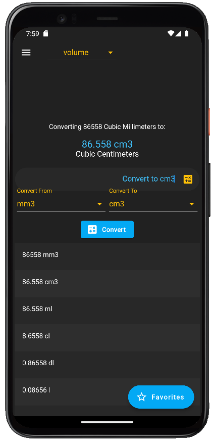
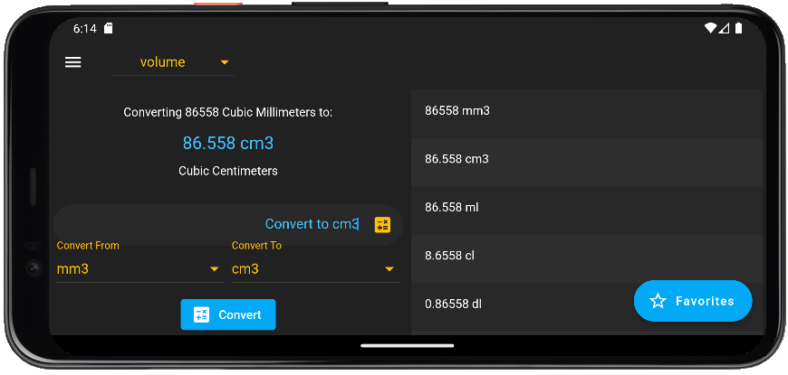

# ConverterMate
Unit Conversion mobile application created using Flutter framework and Dart language. 
This application was created as school project. I created a mobile application that converts various unit measurements such as length, mass, volume, and temperature. The application uses an API to convert the user’s input into the conversion that they selected. The user can select their preferred measurement using a dropdown button from the app bar.

<h3>The following images are portrait and landscape modes.</h3>

 

<h3 align="left">Languages and Tools:</h3>

  

## Progression Dates
April 10, 2023
Application successfully receives a request body using GET method.

April 14, 2023
Application successfully loads multiple API calls to a list view.

April 19, 2023
Application succssfully creates a database for the user to save and edit data. 

April 24, 2023
Most of the UI for application is done.

April 28, 2023
Project is done.
